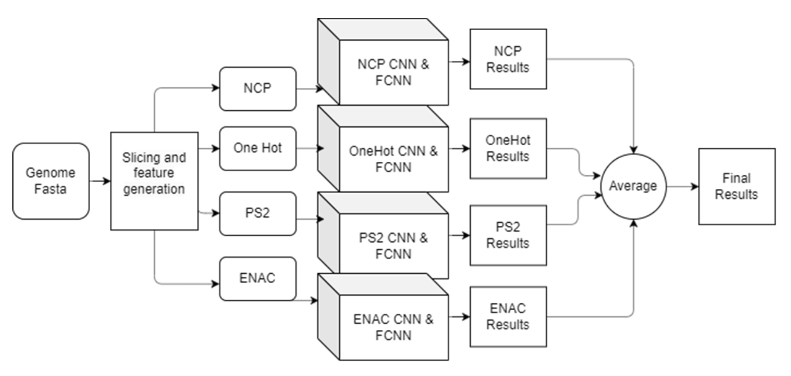
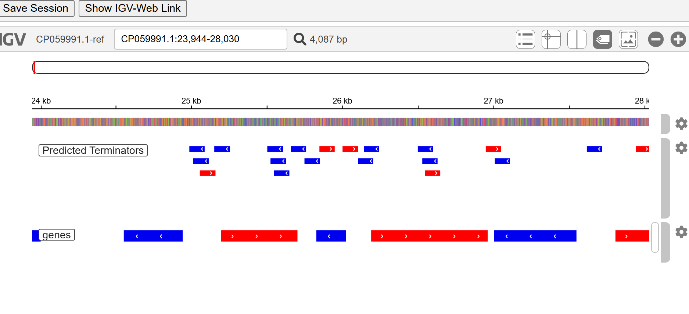

# BacTermFinder: Bacteria-agnostic Comprehensive Terminator Finder using a CNN Ensemble

## Abstract 
Terminator is a region in the DNA that ends the transcription process. Finding bacterial terminators will lead to a better understanding of how bacterial transcription works.  Currently, multiple tools are available for predicting bacterial terminators. However, most methods are specialized for certain bacteria or terminator types. In this work, we developed BacTermFinder, a tool that utilizes Convolutional Neural Networks (CNNs) with four different genomic representations trained on 41k bacterial terminators identified using RNA-seq technologies. Based on our results, BacTermFinder's recall score is higher than that of the other four approaches we considered in our independent validation set of five different bacteria. Moreover, BacTermFinder's model identifies both types of terminators (intrinsic and factor-dependent) and even generalizes to archeal terminators. 


## How to run 
1. Create a virtual environment, we recommend [miniconda](https://docs.anaconda.com/miniconda/install/#),

```
conda create -n bactermfinder python==3.9
```

2. Then install the requirements via (you need to install numpy first for skbio package, then you can install other packages. If you are in Windows, you may need to install C++ compiler for skbio)

```
pip install numpy==1.23.0
```
```
pip install -r requirements.txt
```

3. After that you can run 

`
python genome_scan.py  [genome fasta file] [sliding window step] [prefix for output files] [Feature generation batch size] > log.out 
`

For example:
```bash
python genome_scan.py ref-genome-test.fasta 3 out 10000 > log.out
```

The results would be in a file called `outsequence.fasta_mean.csv`. In this repository, we are including `ref-genome-test.fasta` - CP054306.1-Synechocystis-PCC-7338 - file so that you can run it for testing BacTermFinder. 

The script generates these files and folders:
- `output_sample/` (directory) - *These are encodings (embeddings) of your input file to feature sets. The binary is one hot encoding. Other encodings are described in our paper.*
    - `binary-0.csv`, `binary-1.csv`, ...
    - `ENAC-0.csv`, `ENAC-1.csv`, ...
    - `NCP-0.csv`, `NCP-1.csv`, ...
    - `PS2-0.csv`, `PS2-1.csv`, ...
- `df_sample.fasta` - *input file for the iLearnPlus feature generator*
__________________________________________
- `out-binary(YOUR FASTA FILE/output name).csv` - *These files are the output of each individual CNN model for the corresponding embedding*
- `out-ENAC(YOUR FASTA FILE/output name).csv`
- `out-NCP(YOUR FASTA FILE/output name).csv`
- `out-PS2(YOUR FASTA FILE/output name).csv`
_________________________________________
- `out-(YOUR FASTA FILE/output name)_sliding_windows.csv` - *Sliding windows generated by the Python script*
- `out-(YOUR FASTA FILE/output name)_mean.csv` - *Output averages of the 4 individual CNNs. *
- `log.out` - *This file has running messages from BacTermFinder - If you don't add this to the command line to execute BacTermFinder, messages will be printed to the terminal and you can see how BacTermFinder's run is progressing*

## Sneak peek into the output format
The output would look like below. Each line is a genomic location with BacTermFinder's prediction. It has Sample Name (ref genome id) followed by starting position and ending position in the genome, followed by the strand. The next four columns contain the probability of each CNN and the average of those at the end. See **Threshold for different bacteria** section to understand the probabilities.  
```
SampleName,probability_binary,probability_ENAC,probability_PS2,probability_NCP,probability_mean
1_CP054306.1_0_101_+,0.031499445,0.043600827,0.02189225,0.023103952,0.0300241185
1_CP054306.1_0_101_-,0.04183024,0.049473673,0.019955754,0.014972687,0.031558088500000005
2_CP054306.1_3_104_+,0.15433508,0.07148871,0.29429638,0.07657251,0.14917317
```

BacTermFinder will encode each sequence to four different encodings (binary, ENAC, NCP, PS2) and run a CNN for each of them. After that, the mean of the predictions will be stored in the output file  `outsequence.fasta_mean.csv`.

The log of the execution will be in log.out text file. 

The sliding windows would be in the `out_sequence.fasta_sliding_windows.csv`

### Processing BacTermFinder output
BacTermFinder outputs all sliding windows with their predicted probability to contain a terminator-like sequence. Thus, we reccommend the following steps to process BacTermFinder output:
1. Filter out predictions below the desired probability threshold (see **Threshold for different bacteria** section below).
2. [Optional] Select predictions based on the strand of interest (+ or -).
3. Merge overlapping/consecutive predictions. To find the union between overlapping/consecutive predictions, we recommend using [BedTools' merge command](https://bedtools.readthedocs.io/en/latest/content/tools/merge.html) with the '-s -d 3' options.
4. To adjust the length of merge predictions, find middle of merged predictions and trim from both ends until the desired length (i.e., 101 characters) (see **Scripts to process BacTermFinder output** section below).

## Threshold for different bacteria
We recommend to use  these thresholds to classify terminators. High GC-content bacteria genomes tend to have more factor-dependent terminators - which usually don't have strong motifs - and it's better to use less strict thresholds to find factor-dependent terminators. One issue with less strict thresholds is that there will be more false positive terminators predicted. We got these recommended thresholds by maximizing the F-scores during cross-validation.
<div align="center">

|  Maximizing metric      | Threshold     |
| ----------------------- | ------------- |
| F2 - Less strict        |     0.13      |
| F1 - normal stringency  |     0.3       |
| F0.5 - more strict      |     0.47      |

</div>

## Gene viewer for the final test results of BacTermFinder
You can use [this Google Colab notebook](https://colab.research.google.com/drive/13aW6Kezl-XaPjJ9lY94YDFebeAqbf70f?usp=sharing) to visualize the final predicted results of test data. Simply run all cells.




## Scripts to process BacTermFinder output
```python
# This script gets the CSV file and outputs a BED file. 
import pandas as pd
df = pd.read_csv('outCP001312.1.fasta_mean.csv')
df['SampleName'] = df['SampleName'].str.replace('NC_0', 'NC0') #if the name has _ it will create a bug
df.a = df['SampleName'].str.split('_').str # splitting
# Some namings
df['start'] =df.a[2].astype(int)
df['end'] = df.a[3].astype(int)
print('start and end done')
df['strand'] = df.a[4]
df['chrom'] = df.a[1]
print("strand and chrom done")
df['chrom'] = df['chrom'].str.replace('NC0', 'NC_0')
df['name'] = 'bactermfinder'
df['score'] = df['probability_mean']
# Sorting columns for a bedfile
df = df[['chrom', 'start', 'end', 'name', 'score', 'strand']]
# Filtering based on the threhsold
test = df[df['score']>0.3]
# Saving to bed
test.to_csv('test_r_capsul.bed', index=False, sep='\t', header=False)
```

```bash
# These onliners can help when you want the final results as a bed file with some merging window features.

# Sorting the bed file 
sort -k 1,1 -k2,2n test_r_capsul.bed > r_capsule_pred_sorted.bed

# Merging the results that are 3 nucleotides apart and averaging the score for them. Then, using AWK to center the regions
bedtools merge -s -d -3 -c 4,5,6 -o distinct, mean,distinct -i r_capsule_pred_sorted.bed | awk -F"\t" '{if ($3-$2 > 101) {OFS="\t"; print $1,int(($3-$2)/2)+$2-50,int(($3-$2)/2)+$2+51,$4,$5,$6} else {print}}' > r_capsule_pred_sorted_merged.bed

# If you are predicting only a small region in a fasta file, you can add the offset with this script
cat r_capsule_pred_sorted_merged.bed | awk -F"\t" '{OFS="\t"; print $1,$2+2720330,$3+2720330,$4,$5,$6}' > r_capsule_pred_sorted_merged_plusCoordinate.bed
```

## Please cite it if you've used it!
Thank you very much for using our software, you can cite it as follows: 

```
BacTermFinder: A Comprehensive and General Bacterial Terminator Finder using a CNN Ensemble
Seyed Mohammad Amin Taheri Ghahfarokhi, Lourdes Peña-Castillo. 
bioRxiv 2024.07.05.602086; doi: https://doi.org/10.1101/2024.07.05.602086 
```
